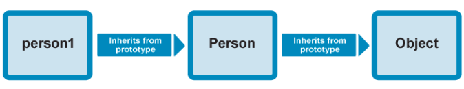

## js脚本 (javascript)  动态编程语言
1. 解释代码(interpret) vs 编译代码(compile)
    ```
    解释型语言: 代码自上而下运行,且实时返回运行结果,代码执行前无需浏览器将其转化为其他形式
    编译型语言: 代码在执行前需要先编译成另一种形式
    综上所述: javascript 是轻量级的解释型语言
2. 服务器端代码 vs 客户端代码
    ```
    编写服务器端代码的语言: PHP、Python、Ruby、ASP.NET 以及 JavaScript(nodejs)
    编写客户端代码的语言: js,css,html
    ``` 

3. 动态代码 vs 静态代码
    ```
    动态页面: 按需生成新内容来更新web页面和应用
    静态页面: 没有动态更新内容的网页
    ``` 

4. js的引用方式
    ```
    1. 内部编写: 如
        <script>
            var a = 1;
        </script>
    2. 外部引用: 如
        <script src="script.js"></script>
    ``` 

5. js注释
    ``` 
    1. 单行注释  //
    2. 多行注释  /* */
    ``` 

6. 猜数字游戏 [demo01.html](./demo01.html)    
7. js变量
    1. 变量是用来存储数值的容器
    2. 变量的命名规则
        ```
        1. 变量名不要以下划线开头
        2. 变量名不要以数字开头
        3. 变量名大小写敏感
        4. 避免使用JavaScript的保留字给变量命名, 如var, function, let, for
        5. 推荐使用 小驼峰命名法, 如 myAge
       ```
    3. javascript中数字类型和运算符
        1. 数字类型
            ```
            1. 十进制
                ① 整数
                ② 浮点数 32位 占4个字节  有效数字8位 表示范围：-3.40E+3 ~ +3.40E+38
                ③ 双精度 64位 占8个字节  有效数字16位 表示范围：-1.79E+308 ~ +1.79E+308
            2. 二进制 0和1
            3. 八进制 0-7
            4. 十六进制 0-9 a-f
            ``` 

        2. 算术运算符   

            | 算术运算符 | 例子 |
            |:---:|:----:|
            | + | 6 + 9 |
            | - | 20 - 15 |
            | * | 3 * 8 |
            | / | 10 / 5 |
            | % | 8 % 3 余2 |
            | ++ | y = 5; &nbsp; x = ++y; &nbsp; x = 6 |
            | -- | y = 5; &nbsp; x = --y; &nbsp; x = 4 |
            | ** | 5 ** 5 = 3125 (等价于 5^5) |
            | += | x=3; &nbsp; x += 4; (等价于 x = x + 4) |
            | -= | x=3; &nbsp; x -= 4; (等价于 x = x - 4) |
            | *= | x=3; &nbsp; x *= 4; (等价于 x = x * 4) |
            | /= | x=3; &nbsp; x /= 4; (等价于 x = x / 4) | 

        3. 比较运算符 [demo02](demo02.html) 

            | 比较运算符 | 名称 | 例子 |
            | :---: | :--: | :--: |
            | === | 全等于 | 5 === 2 + 4 |
            | !== | 全非等 | 5 !== 2 + 3 |
            | < | 小于 | 10 < 6 |
            | > | 大于 | 10 > 20 |
            | <= | 小于等于 | 3 <= 2 |
            | >= | 大于等于 | 5 >= 4 |  

        4. 逻辑运算符
            ```
            1. && ——逻辑与 都为true时, 返回true
            2. || ——逻辑或 只要有一个位true, 返回true
            3. !  ——逻辑非 非true即false, 非false即true
            ``` 

    4. js中的常见转义字符   

        | 代码 | 输出 |
        | :--: | :----: |
        | \\' | 单引号 |
        | \\" | 双引号 |
        | \\& | 和号 |
        | \\\\ | 反斜杠 |
        | \n | 换行符 |
        | \r | 回车符 |
        | \v | 垂直制表符 |
        | \t | 水平制表符 |
        | \b | 退格符 |
        | \f | 换页符 | 

    5. 字符串的操作
        ```
        1. 获取字符串长度  
            var str = 'Hello';
            str.length = 4;
        2. 获取特定的字符串字符
            str[0] = 'H';
            str[str.length - 1] = 'o';
        3. 在字符串中查找字符串
            str.indexOf('ll') = 2;
            str.indexOf('small') = -1;  找不到返回 -1
        4. 截取字符串
            str.slice(0,3) = 'Hel';
            str.slice(2) = 'llo';
        5. 改变字符串的格式
            str.toLowerCase() = 'hello';
            str.toUpperCase() = 'HELLO';
        6. 更新字符串部分内容
            str.replace('ello', 'i') = 'Hi';
        ``` 

    6. 数组的操作 [demo03.html](demo03.html) 和 [demo07.html](demo07.html)
        ```
        1. 数组
            var shopping = ['面包', '牛奶', '烤肠'];
            shopping.length = 2
            shopping[0] = '面包'
        2. 二维数组
            var random = ['tree', 795, [0, 1, 2]];
            random[2][2] = 2;
        3. 字符串转数组
            var str = 'Hello,World';
            var strToArr = str.split(',');
            strToArr = ['Hello','World'];
        4. 数组转字符串
            ① join()
                var newStr = strToArr.join(',');
                newStr = 'Hello,World';
            ② toString()
                var userList = ['张三', '李四', '王五'];
                userList.toString();  // '张三,李四,王五'
        5. 数组的添加和删除
            ① push() 在数组的末尾添加
                var cityList = ['上海', '广州', '深圳'];
                cityList.push('郑州'); // 4
                cityList // ['上海', '广州', '深圳', '郑州']
            ② pop() 在数组的末尾删除
                var cityList = ['上海', '广州', '深圳', '郑州'];
                cityList.pop();  // '郑州'
                cityList // ['上海', '广州', '深圳']
            ③ unshift() // 在数组的开始添加
                var cityList = ['上海', '广州', '深圳'];
                cityList.unshift('北京'); // 4
                cityList // ['北京', '上海', '广州', '深圳']
            ④ shift() // 在数组的开始删除
                var cityList = ['北京', '上海', '广州', '深圳'];
                cityList.shift(); // '北京'
                cityList // ['上海', '广州', '深圳']
        ``` 

    7. 条件判断
        1. if...else... 
        2. if...else if...else...
        3. switch...case...
            ```
            switch (expression) {
                case choice1:
                    run this code
                    break;

                case choice2:
                    run this code instead
                    break;
                ......
                default:
                    actually, just run this code
            }
            ``` 

        4. 三元运算符
            `old > 18 ? '成年' : '未成年';`
    8. 循环 
        1. for
            ```
            for (初始化,退出条件,最终条件) {
                // 执行
            }
            ``` 

        2. break 终止循环
        3. continue 跳过迭代
        4. while 先判断在执行
            ```
            初始化
            while (退出条件) {
                // 执行
                最终条件
            }
            ``` 

        5. do...while 先执行在判断
            ```
            初始化
            do {
                // 执行
                最终条件
            } while (退出条件)
            ``` 

    9. 常用的math对象  

        | 方法 (x,y 代表数值) | 描述 |
        | :-------------: | :--: |
        | Math.ceil(x) | 对数进行向上取整 |
        | Math.floor(x) | 对数进行向下取整 |
        | Math.max(x,y) | 返回x和y中的最大值 |
        | Math.min(x,y) | 返回x和y中的最小值 |
        | Math.random() | 返回 0~1 之间的随机数 |
        | Math.round(x) | 把数四舍五入为最接近的整数 | 

    10. 函数
        ```
        1. 自定义函数
            function random(number) {
                return Math.floor(Math.random()*number);
            }
        2. 函数的调用 random(10);
        3. 匿名函数 
            function() {
                alert('hello');
            }
        4. 调用匿名函数
            1. 赋值给变量调用
                var hello = function() {
                    alert('hello');
                }
                hello();
            2. 匿名函数自调
                (function() {
                    alert('hello');
                })();
            3. 事件绑定来调用
                myButton.onclick = function() {
                    alert('hello');
                }

        5. 函数参数
            function add(num1, num2) {
                return num1+num2;
            }
        6. 函数作用域
            1. 全局作用域: 所有函数的最外层, 全局作用域定义的值可在任意地方使用
            2. 局部作用域: 函数内部
        ``` 

    11. 事件
        1. 事件的监听和移除
            ```
            var btn = document.querySelector('button');

            function bgChange() {
                var rndCol = 'rgb(' + random(255) + ',' + random(255) + ',' + random(255) + ')';
                document.body.style.backgroundColor = rndCol;
            }   

            btn.addEventListener('click', bgChange);  // 监听事件
            btn.removeEventListener('click', bgChange); //移除事件
            ``` 

        2. 事件对象 [demo05.html](demo05.html)
            <span style="color: green;">多用于在多个元素上设置相同的事件处理程序</span>
        3. 阻止默认行为  
            <span style="color: red;">e.preventDefault();</span>
        4. 事件冒泡及捕获   
            ① 事件的捕获  

                浏览器检查元素的最外层祖先<html>,是否注册了onclick事件，如果是，则运行它。
                然后移动到<html>中的下一个元素，并执行相同的操作，直至到达实际点击的元素。
            ② 冒泡阶段(默认)

                从里向外依次检查是否注册onclick事件，如果是，则运行它。
            ③ 阻止冒泡 
                <span style="color: red;">e.stopPropagation();</span>
        5. 事件委托 (利用冒泡) [demo06.html](demo06.html)
    12. 对象 —— 包含相关数据和方法的集合
        1. 对象的定义
            ```
            var person = {
                name : ['Bob', 'Smith'],
                age : 32,
                gender : 'male',
                interests : ['music', 'skiing'],
                bio : function() {
                    alert(this.name[0] + ' ' + this.name[1] + ' is ' + this.age + ' years old. He likes ' + this.interests[0] + ' and ' + this.interests[1] + '.');
                },
                greeting: function() {
                    alert('Hi! I\'m ' + this.name[0] + '.');
                }
            };
            person对象由 4个属性和2个方法 构成
            ``` 

        2. 获取对象属性值的两种方法
            ```
            点表示法
                person.age
            括号表示法
                person['age']
            ``` 

        3. 设置对象属性的值
            ```
            改变属性的值
                person.age = 45
            添加新的属性
                person.height = '170cm'
                person['height'] = '170cm'
            ```  
        
        4. 将对象转换成数组的方法 Object.keys(obj)
           ```
           var obj = { 0: 'a', 1: 'b', 2: 'c' };
           console.log(Object.keys(obj)); // ['0', '1', '2']
           ```

    13. 构造函数(类)的创建实例化对象的方法  
        1.  创建构造函数，通过new 实例化对象
            ```  
            function Person(first, last, age, gender, interests) {
                this.name = { first, last};
                this.age = age;
                this.gender = gender;
                this.greeting = function() {
                    alert('Hi! I\'m ' + this.name.first + '.');
                };
            }
            var person1 = new Person('Bob', 'Smith', 32, 'male', ['music', 'skiing']);
            ```

        2. 使用Object()构造函数创建一个空对象
            ```
            var person1 = new Object();
            ``` 

            ```
            person1.name = 'Chris';
            person1['age'] = 38;
            person1.greeting = function() {
                alert('Hi! I\'m ' + this.name + '.');
            }
            ```
            <span style="color:red;">或</span>
            ```
            var person1 = new Object({
                name : 'Chris',
                age : 38,
                greeting : function() {
                    alert('Hi! I\'m ' + this.name + '.');
                }
            });
            ``` 
        3. 使用create()方法，创建基于现有对象创建新的对象实例 —— ie9+支持
            ```
            var person2 = Object.create(person1);
            person2是基于person1创建的
            ```
    14. 理解JavaScript中的原型
        1. 原型(prototype) —— 每个函数都有一个特殊的属性(可通过浏览器控制台查看函数的__proto__)
        2. 原型链的理解     
            
            ```
            // 首先创建一个构造函数
            function Person(first, last, age, gender, interests) {
                // 属性与方法定义
            };
            // 然后创建一个对象实例
            var person1 = new Person('Bob', 'Smith', 32, 'male', ['music', 'skiing']);
            // 调用person1实例中的valueOf(),浏览器会执行什么操作？
            person1.valueOf()  —— valueOf()方法会返回 Boolean 对象的原始值

            浏览器通过原型链的方式查找valueOf()方法，都没有的话，返回undefined。
                ① 浏览器首先检查，person1 对象是否具有可用的 valueOf() 方法。
                ② 如果没有，则浏览器检查 person1 对象的原型对象（即 Person构造函数的prototype属性所指向的对象）是否具有可用的 valueof() 方法。
                ③ 如果也没有，则浏览器检查 Person() 构造函数的prototype属性所指向的对象的原型对象（即 Object构造函数的prototype属性所指向的对象）是否具有可用的 valueOf() 方法。这里有这个方法，于是该方法被调用。
            ``` 

        3. 修改原型
            ```
            // 构造器及其属性定义
            function Test(a,b,c,d) {
            // 属性定义
            };
            // 定义第一个方法
            Test.prototype.x = function () { ... }
            // 定义第二个方法
            Test.prototype.y = function () { ... }
            // 等等……
            ```

    15. 面向对象编程 OOP(Object Oriented Programming)
        1. 封装的三种形式
            1. 创建对象：将属性和方法封装成一个对象
            2. 创建构造函数：为了解决从原型对象生成实例的问题, 缺点：添加一个不变的属性时，会浪费内存 (验证原型对象与实例对象的关系 instanceof)
                ```
                // 创建原型对象
                function Cat(name,color) {
                    this.name = name;
                    this.color = color;
                    this.type = '猫科动物';
                    this.eat = function(){ alert('吃老鼠'); }
                }
                // 生成实例对象
                var cat1 = new Cat('小黄','黄色');
                // 这时cat1 自动包含一个constructor属性,指向它的构造函数
                cat1.constructor == Cat   // true
                // 也可用 instanceof 验证原型对象与实例对象之间的关系
                cat1 instanceof Cat  // true
                ``` 

            3. 使用原型对象(每个构造函数都有一个prototype属性,指向原型对象) 可将不变的属性和方法放到原型对象中，可提高运行效率 
                ```
                1. 实例
                    function Cat(name,color){
                　　　　this.name = name;
                　　　　this.color = color;
                　　 }
                　　 Cat.prototype.type = "猫科动物";
                　　 Cat.prototype.eat = function(){alert("吃老鼠")};
                2. 验证方法
                    ① isPrototypeOf() 验证prototype对象与实例之间关系的方法
                        Cat.prototype.isPrototypeOf(cat1);  // true
                    ② hasOwnProperty() 判断某一个属性是本地属性，或是继承自prototype对象的属性
                        cat1.hasOwnProperty("name");  // true
                        cat1.hasOwnProperty("type");  // false
                    ③ in 判断实例是否包含某个属性
                        "name" in cat1   // true
                ``` 
        2. 继承
            1. 构造函数的继承
                ```
                1. 声明两个构造函数，分别为"动物"和"猫"对象的构造函数
                    function Animal() {
                        this.species = "动物";
                    }
                    function Cat(name,color) {
                        this.name = name;
                        this.color = color;
                    }

                2. 让"猫"继承"动物"的方法
                    ① 构造函数绑定 —— 利用call或者apply方法，将父对象的构造函数绑定在子对象上(父对象改变，对子对象没有影响，因为二者的原型对象不一样)
                        function Cat(name,color){
                    　　　　 Animal.call(this, arguments);
                    　　　　 this.name = name;
                    　　　　 this.color = color;
                    　　 } 

                        或

                    　　 function Cat(name,color){
                    　　　　 Animal.apply(this, arguments);
                    　　　　 this.name = name;
                    　　　　 this.color = color;
                    　　 }
                    　　 var cat1 = new Cat("大毛","黄色");
                    　　 alert(cat1.species); // 动物

                    ② prototype模式 —— 将"猫"的prototype对象指向一个Animal的实例，所有"猫"的实例都可以继承Animal
                        Cat.prototype = new Animal(); // 任何一个prototype对象都有一个constructor属性，指向它的构造函数
                    　　 Cat.prototype.constructor = Cat;  // 替换原型对象时，需重新指定原型对象的构造函数，以免导致"继承链"的紊乱
                        var cat1 = new Cat("大毛","黄色");
                    　　 alert(cat1.species); // 动物

                    ③ 直接继承prototype —— "猫"直接继承"动物"的原型对象
                        // 先将Animal的species属性放入原型对象中
                    　　 function Animal() { }
                        Animal.prototype.species = "动物";
                        // 然后将Cat的prototype对象指向Animal的prototype对象
                        Cat.prototype = Animal.prototype;
                        Cat.prototype.constructor = Cat; // 缺点是把Animal.prototype对象的constructor属性也改掉了
                        var cat1 = new Cat("大毛","黄色");
                        alert(cat1.species); // 动物 

                    ④ 利用空对象作为中介 —— 避免修改Cat的prototype对象时影响到Animal的prototype对象，还可以节省内存
                        var F = function() { };
                        F.prototype = Animal.prototype;
                        Cat.prototype = new F();
                        Cat.prototype.constructor = Cat;
                        // 可将上述方法封装成一个函数
                        function extend(Child, Parent) {
                            var F = function() {};
                            F.prototype = Parent.prototype;
                            Child.prototype = new F();
                            Child.prototype.constructor = Child;
                            Child.uber = Parent.prototype;  // 保存父类的prototype 这样就可以在子类中随时调用父类的东西
                        }
                        // 调用方法
                        extend(Cat, Animal);
                        var cat1 = new Cat("小黄","黄色");
                        alert(cat1.species); // 动物

                    ⑤ 拷贝继承
                        // 先将Animal的species属性放入原型对象中
                    　　 function Animal() { }
                        Animal.prototype.species = "动物";
                        // 再写一个函数，实现属性拷贝的目的
                        function extend2(Child, Parent) {
                　　　　    var p = Parent.prototype;
                　　　　    var c = Child.prototype;
                    　　　　for (var i in p) {
                    　　　　　　c[i] = p[i];
                    　　　　}
                　　　　    c.uber = p;
                    　　}
                        // 调用方法
                        extend2(Cat, Animal);
                    　　 var cat1 = new Cat("大毛","黄色");
                    　　 alert(cat1.species); // 动物   

                    ⑥ 利用Object.create(新创建对象的原型对象, 添加到新对象的属性——可选)实现单个对象的继承
                        // Shape - 父类(superclass)
                        function Shape() {
                            this.x = 0;
                            this.y = 0;
                        }

                        // 父类的方法
                        Shape.prototype.move = function(x, y) {
                            this.x += x;
                            this.y += y;
                            console.info('Shape moved.');
                        };

                        // Rectangle - 子类(subclass)
                        function Rectangle() {
                            Shape.call(this); // call super constructor.
                        }

                        // 子类续承父类
                        Rectangle.prototype = Object.create(Shape.prototype);
                        Rectangle.prototype.constructor = Rectangle;

                        var rect = new Rectangle();

                        console.log('Is rect an instance of Rectangle?',
                        rect instanceof Rectangle); // true
                        console.log('Is rect an instance of Shape?',
                        rect instanceof Shape); // true
                        rect.move(1, 1); // Outputs, 'Shape moved.'

                    ⑦ 利用Object.assign(prototype1, prototype2, ...)实现多个对象的继承
                        // 先将superClass和OtherSuperClass的方法绑定到MyClass上
                        function MyClass() {
                            SuperClass.call(this);
                            OtherSuperClass.call(this);
                        }
                        // 继承一个类
                        MyClass.prototype = Object.create(SuperClass.prototype);
                        // 混合其它
                        Object.assign(MyClass.prototype, OtherSuperClass.prototype);
                        // 重新指定constructor
                        MyClass.prototype.constructor = MyClass;

                        MyClass.prototype.myMethod = function() {
                            // do a thing
                        };
                ``` 

            2. 非构造函数的继承
                ```
                1. 声明两个普通对象，分别为"中国人"和"医生"的普通对象
                    var Chinese = {
                　　　　nation:'中国'
                　　 }
                    var Doctor ={
                　　　　career:'医生'
                　　 }

                2. 让"医生"继承"中国人"，即生成一个"中国医生"的对象的方法
                    ① object()
                        // 把子对象的prototype属性指向父对象
                        function object(o) {
                    　　　　function F() {}
                    　　　　F.prototype = o;
                    　　　　return new F();
                    　　}
                        // 在父对象的基础上生成子对象
                        var Doctor = object(Chinese);
                        // 将子对象本身的属性加入
                        Doctor.career = '医生';
                        alert(Doctor.nation); // 中国

                3. 浅拷贝 —— 拷贝对象类型的数据（早期jQuery实现继承的方式）
                    // 把父对象的属性，全部拷贝给子对象(拷贝数据)
                    function extendCopy(p) {
                　　　　var c = {};
                　　　　for (var i in p) { 
                　　　　　　c[i] = p[i];
                　　　　}
                　　　　c.uber = p;
                　　　　return c;
                　　}
                    // 调用方法
                    var Doctor = extendCopy(Chinese);
                　　 Doctor.career = '医生';
                　　 alert(Doctor.nation); // 中国

                4. 深拷贝 —— 实现真正意义上的数组和对象的拷贝 （现在jQuery实现继承的方式）
                    // 拷贝 数据及其类型
                    function deepCopy(p, c) {
                　　　　var c = c || {};
                　　　　for (var i in p) {
                　　　　　　if (typeof p[i] === 'object') {
                　　　　　　　　c[i] = (p[i].constructor === Array) ? [] : {};
                　　　　　　　　deepCopy(p[i], c[i]);
                　　　　　　} else {
                　　　　　　　　　c[i] = p[i];
                　　　　　　}
                　　　　}
                　　　　return c;
                　　}
                    // 调用方法
                    var Doctor = deepCopy(Chinese);
                    // 给父对象加一个属性，值为数组。然后，在子对象上修改这个属性
                　　 Chinese.birthPlaces = ['北京','上海','香港'];
                    Doctor.birthPlaces.push('厦门');
                    // 父对象就不会受到影响了
                    alert(Doctor.birthPlaces); //北京, 上海, 香港, 厦门
                    alert(Chinese.birthPlaces); //北京, 上海, 香港
                ``` 

        3. 多态 —— 把“做什么”和“谁去做”分离开来，实现不同的命令会做不同的事情
            ```
            1. 假设有两家可选的地图软件，有相同调用地图的API
                var googleMap = {
                    show: function(){
                        console.log( '开始渲染谷歌地图' );
                    }
                };

                var renderMap = function(){
                    googleMap.show();
                };
                renderMap(); // 输出：开始渲染谷歌地图

            2. 同时支持谷歌地图和百度地图
                var googleMap = {
                    show: function(){
                        console.log( '开始渲染谷歌地图' );
                    }
                };

                var baiduMap = {
                    show: function(){
                        console.log( '开始渲染百度地图' );
                    }
                };

                var renderMap = function( type ){
                    if ( type === 'google' ){
                        googleMap.show();
                    }else if ( type === 'baidu' ){
                        baiduMap.show();
                    }
                };

                renderMap( 'google' ); // 输出：开始渲染谷歌地图
                renderMap( 'baidu' ); // 输出：开始渲染百度地图

            3. 把程序中相同的部分抽象出来，实现多态
                var renderMap = function( map ){
                    if ( map.show instanceof Function ){
                        map.show();
                    }
                };

                var googleMap = {
                    show: function(){
                        console.log( '开始渲染谷歌地图' );
                    }
                };
                var baiduMap = {
                    show: function(){
                        console.log( '开始渲染百度地图' );
                    }
                };

                renderMap( googleMap ); // 输出：开始渲染谷歌地图
                renderMap( baiduMap ); // 输出：开始渲染百度地图
            ``` 

    16. JSON —— 一种按照JavaScript对象语法的数据格式
        ```
        1. JSON作为一个对象时，用于解读JSON中的数据；JSON作为一个字符串时，用于网络传输JSON数据

        2. JSON对象的媒体类型(MIME type) —— application/json
        
        3. JSON结构
            ① JSON对象 —— 基于js的对象
                {
                    "squadName" : "Super hero squad",
                    "homeTown" : "Metro City",
                    "formed" : 2016,
                    "secretBase" : "Super tower",
                    "active" : true,
                    "members" : [
                        {
                            "name" : "Molecule Man",
                            "age" : 29,
                            "secretIdentity" : "Dan Jukes",
                            "powers" : [
                                "Radiation resistance",
                                "Turning tiny",
                                "Radiation blast"
                            ]
                        },
                        {
                            "name" : "Madame Uppercut",
                            "age" : 39,
                            "secretIdentity" : "Jane Wilson",
                            "powers" : [
                                "Million tonne punch",
                                "Damage resistance",
                                "Superhuman reflexes"
                            ]
                        }
                    ]
                }
            ② JSON数组 —— 基于js的数组
                [
                    {
                        "name" : "Molecule Man",
                        "age" : 29,
                        "secretIdentity" : "Dan Jukes",
                        "powers" : [
                        "Radiation resistance",
                        "Turning tiny",
                        "Radiation blast"
                        ]
                    },
                    {
                        "name" : "Madame Uppercut",
                        "age" : 39,
                        "secretIdentity" : "Jane Wilson",
                        "powers" : [
                        "Million tonne punch",
                        "Damage resistance",
                        "Superhuman reflexes"
                        ]
                    }
                ]
            ③ 注意事项
                (1) JSON 是一种纯数据格式，它只包含属性，没有方法。
                (2) JSON 要求有两头的 { } 来使其合法。最安全的写法是有两边的括号，而不是一边。
                (3) 甚至一个错位的逗号或分号就可以导致  JSON 文件出错。您应该小心的检查您想使用的数据(虽然计算机生成的 JSON 很少出错，只要生成程序正常工作)。您可以通过像 JSONLint 的应用程序来检验 JSON。
                (4) JSON 可以将任何标准合法的 JSON 数据格式化保存，不只是数组和对象。比如，一个单一的字符串或者数字可以是合法的 JSON 对象。虽然不是特别有用处……
                (5) 不像 JavaScript 标识符可以用作属性，在 JSON 中，只有字符串才能用作属性。
        4. 对象和文本间的转换
            JSON.parse() —— 以文本字符串形式接受JSON对象作为参数，并返回相应的对象
            JSON.stringify() —— 接收一个对象作为参数，返回一个对应的JSON字符串
        ``` 

    17. 操作实例 —— [弹球](demo08.html)
        小球会在屏幕上弹跳，当它们碰到彼此时会变色
    
    18. Web API
        1. 客户端JavaScript中的API
            ```
            1. 浏览器API内置于Web浏览器中，能从浏览器和电脑周边环境中提取数据，并用来做有用的复杂的事情
            2. 第三方API缺省情况下不会内置于浏览器中，通常必须在Web中的某个地方获取代码和信息
            ``` 

        2. JavaScript，API和其他JavaScript工具之间的关系
            ```
            1. JavaScript —— 一种内置于浏览器的高级脚本语言，您可以用来实现Web页面/应用中的功能
            2. 客户端API — 内置于浏览器的结构程序，位于JavaScript语言顶部，使您可以更容易的实现功能
            3. 第三方API — 置于第三方普通的结构程序（例如Twitter，Facebook)，使您可以在自己的Web页面中使用那些平台的某些功能
            4. JavaScript库 — 通常是包含具有特定功能的一个或多个JavaScript文件，把这些文件关联到您的Web页以快速或授权编写常见的功能。例如包含jQuery和Mootools
            5. JavaScript框架 — 从库开始的下一步，JavaScript框架视图把HTML、CSS、JavaScript和其他安装的技术打包在一起，然后用来从头编写一个完整的Web应用
            ``` 

        3. 常见的浏览器API
            ```
            1. 操作文档的API —— DOM
            2. 从服务器获取数据的API —— XMLHttpRequest 和 Fetch API
            3. 用于绘制和操作图形的API —— Canvas(2D) 、 WebGL(3D) 和 创建动画循环的API —— requestAnimationFrame()
            4. 音频和视频API —— HTMLMediaElement，Web Audio API和WebRTC
            5. 设备API —— 地理定位API 、系统通知 Notifications API 和 振动硬件 Vibration API
            6. 客户端存储API —— 使用Web Storage API的简单的键 - 值存储 和 使用IndexedDB API的更复杂的表格数据存储
            ``` 
        
        4. API的工作原理  
            1. 它们是基于对象的, 如[Geolocation API](demo09.html) 包含三个对象：
                ```
                ① Geolocation, 其中包含三种控制地理数据检索的方法。
                ② Position, 表示在给定的时间的相关设备的位置。
                ③ Coordinates, 其中包含有关设备位置的大量有用数据，包括经纬度，高度，运动速度和运动方向等
                ``` 

            2. 它们有可识别的入口点
                ```
                ① 在Geolocation API中，它是 Navigator.geolocation 属性, 它返回浏览器的 Geolocation 对象，所有有用的地理定位方法都可用。
                
                ② 文档对象模型 (DOM) API，通常挂在 Document 对象
                    var em = document.createElement('em');
                    var para = document.querySelector('p'); 
                    em.textContent = 'Hello there!';
                    para.appendChild(em);

                ③ 稍微复杂的入口点，需要编写特定的上下文，如Canvas API的上下文对象是通过获取要绘制的 <canvas> 元素的引用来创建的，然后调用它的HTMLCanvasElement.getContext()方法
                    var canvas = document.querySelector('canvas');
                    var ctx = canvas.getContext('2d');
                ``` 
            
            3. 它们使用事件来处理状态的变化, 如从服务器获取数据的API —— XMLHttpRequest
                ```
                var requestURL = 'https://mdn.github.io/learning-area/javascript/oojs/json/superheroes.json';
                var request = new XMLHttpRequest();
                request.open('GET', requestURL);
                request.responseType = 'json';
                request.send();
                // 成功响应后执行onload
                request.onload = function() {
                    var superHeroes = request.response;
                    console.log(superHeroes);
                }
                ``` 

            4. 它们在适当的地方有额外的安全机制
                ```
                WebAPI功能受到与JavaScript和其他Web技术（例如同源政策）相同的安全考虑 但是他们有时会有额外的安全机制。一旦调用WebAPI请求，用户就可以在您的代码中启用一些WebAPI请求权限。
                ``` 

        5. web浏览器的重要部分
            1. 文档对象模型 DOM

            2. 浏览器对象模型 BOM

        6. 从服务器获取数据 —— XMLHttpRequest 和 Fetch API

        7. 画图 —— canvas API 和 WebGL

        8. 视频和音频API —— HTMLMediaElement API (video和audio)

        9. 客户端存储 —— cookies(传统方法)、Web Storage和IndexedDB(新流派) 、Cache API(未来)

    19. 可访问性   

            


            

            


        
        

